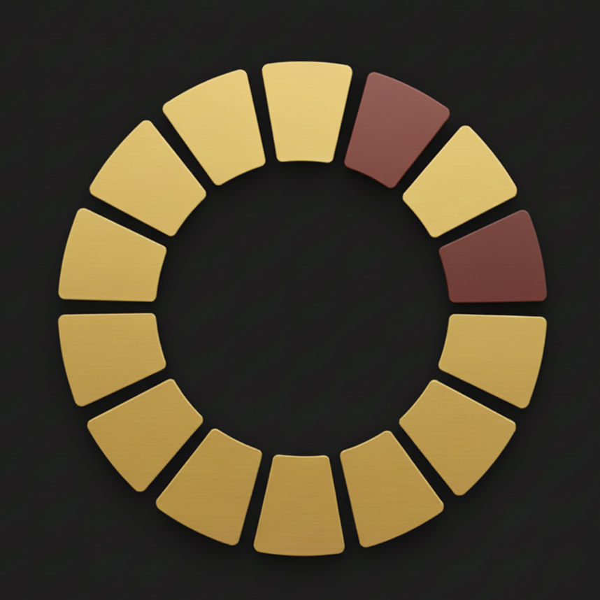

<p align="center">
  
</p>

<h1 align="center">Clazzy</h1>

<p align="center">
  <strong>Your life. Every minute. Visualized.</strong><br>
  A premium time-tracking & personal productivity app built with Flutter.
</p>

<p align="center">
  
  
  
  
  
  
</p>

---

## 🧠 What is Clazzy?

Clazzy is a **zero-friction, always-on time tracker** designed for people who want brutal honesty about where their time goes. Unlike traditional time trackers that require manual start/stop, Clazzy tracks **every single second** — categorizing your time into Deep Work, Personal, Wasted, and Sleep buckets so you can confront reality.

> **The philosophy:** You're always doing *something*. Clazzy simply asks: *what?*

---

## ✨ Core Features

### ⏱️ Passive Time Tracking
- **Always-on timer** — the moment you open Clazzy, it's tracking. No start/stop buttons.
- **One-tap task switching** — switch between tasks from a beautiful grid on the home screen.
- **"Unknown" time bucket** — unassigned time is automatically flagged in red so you know exactly how much time slips through the cracks.
- **Session notes** — add context to any time entry while it's active.

### 📅 Calendar & Scheduling
- **Full-day timeline view** — a vertical 24-hour timeline with color-coded event blocks showing your planned schedule.
- **Recurring events** — support for daily and weekly recurrence with specific day selection.
- **Event completion tracking** — mark events as completed, with per-instance tracking for recurring events.
- **"Now" indicator** — see at a glance what's currently happening and what's next.
- **Overlapping event handling** — intelligent column-based layout when events overlap.
- **Month grid** with event indicators for quick navigation.

### 🎯 Goals & Deadlines
- **Daily time goals** — set a target (e.g., "4 hours of Deep Work") and track progress with visual ring indicators.
- **Attendance goals** — track how many scheduled events (e.g., "DSA Class") you actually attended.
- **Deadline management** — full deadline system with statuses (overdue, due today, due tomorrow, this week, later).
- **Smart grouping** — deadlines are automatically grouped by urgency with color-coded labels.
- **Swipe-to-delete with undo** — intuitive gesture-based management.

### 📚 Knowledge Hub (Library)
- **Learning input tracker** — catalog books, videos, courses, podcasts, blogs, and articles you're consuming.
- **Multi-view modes** — toggle between **List**, **Tree**, and **Board** views per category.
- **Status workflow** — Saved → In Progress → Completed → Archived.
- **URL linking** — attach source URLs and open content directly from the app.
- **Rich notes** — add descriptions, tags, and estimated completion times.
- **Category management** — rename, delete, and organize learning categories.

### 📊 Analytics (3-Tier)

| View | What It Shows |
|------|---------------|
| **Raw View** | Day timeline (reality vs plan), time distribution stacked bar, task breakdown, event performance (planned vs executed side-by-side) |
| **Weekly** | Pie chart allocation, daily bar chart, task breakdown with active-day badges, goals vs actual progress bars, attendance summary |
| **Monthly** | Donut chart allocation, category breakdown, goals vs actual, calendar heatmap (intent vs reality), consistency heatmap (GitHub-style), daily trend lines |

### 🔔 Smart Notifications
- **In-app overlay notifications** — beautifully animated, glassmorphic notification banners with action buttons.
- **System notifications** — native push notifications for Android, iOS, and Web.
- **Multiple notification types**: Calendar reminders, task switch prompts, goal progress alerts, break reminders.

### 🎨 Task Management
- **Custom tasks** with name, subtitle, color picker, and category assignment.
- **Category system** — organize tasks into categories (Learning, Work, Health, etc.) that map to base types.
- **5 base types** for analytics: `DEEP WORK`, `PERSONAL`, `WASTED`, `SLEEP`, `UNKNOWN`.
- **Full color picker** — HSL-based color wheel for precise task coloring.

---

## 🏛️ Architecture

```
lib/
├── main.dart                    # App entry point, theme configuration
├── constants/
│   ├── colors.dart              # Design system color palette
│   └── app_theme.dart           # Extended theme constants
├── models/
│   ├── task_node.dart           # Activity/task definition
│   ├── time_entry.dart          # Time tracking record
│   ├── scheduled_event.dart     # Calendar event with recurrence
│   ├── goal.dart                # Time & attendance goals
│   ├── learning_input.dart      # Knowledge Hub items
│   └── deadline_item.dart       # Deadline tracking
├── providers/
│   └── time_tracking_provider.dart  # Central state (1,265 lines)
├── screens/
│   ├── app_shell.dart           # Navigation shell with floating navbar
│   ├── home_screen.dart         # Timer card, quick stats, today's reality
│   ├── calendar_screen.dart     # Full-day timeline & event management
│   ├── goals_screen.dart        # Goals, attendance & deadlines
│   ├── knowledge_hub_screen.dart # Learning input library
│   ├── stats_screen.dart        # Analytics hub (Raw/Weekly/Monthly tabs)
│   ├── weekly_analytics_screen.dart
│   ├── monthly_analytics_screen.dart
│   ├── manage_tasks_screen.dart # Task & category CRUD
│   └── full_day_screen.dart     # Detailed timeline of today's entries
├── services/
│   ├── notification_service.dart # Cross-platform notifications
│   ├── web_notifications.dart
│   └── web_notifications_stub.dart
└── widgets/
    └── app_fab.dart             # Floating action button widget
```

---

## 🛠️ Tech Stack

| Layer | Technology | Purpose |
|-------|-----------|---------|
| **Framework** | Flutter 3.9+ | Cross-platform UI |
| **Language** | Dart 3.0+ | Application logic |
| **State Management** | Provider | Reactive state with `ChangeNotifier` |
| **Local Storage** | Hive + Hive Flutter | NoSQL object storage (7 boxes) |
| **Code Generation** | build_runner + hive_generator | TypeAdapter auto-generation |
| **Charts** | fl_chart | Pie, bar, and line chart visualizations |
| **Typography** | Google Fonts (Inter) | Premium font rendering |
| **Notifications** | flutter_local_notifications | System-level push notifications |
| **Unique IDs** | uuid | UUID v4 generation for all entities |
| **URL Handling** | url_launcher | External link opening |
| **Date Formatting** | intl | Localized date/time formatting |

---

## 🎨 Design Language

- **Theme**: Dark mode only — true black (`#000000`) background with `#1E1E1E` surface cards
- **Accent**: Muted gold (`#E6C84C`) — used sparingly for active states and highlights
- **Typography**: Inter via Google Fonts — clean, modern, highly legible
- **Navigation**: Floating glassmorphic bottom navbar with `BackdropFilter` blur
- **Animations**: Pulse animations on the timer card, smooth page transitions with `PageView`, animated tab indicators
- **Cards**: Rounded corners (12-24px), no elevation, subtle borders at 3-8% white opacity
- **Color Palette**: 16 curated colors for task customization

---

## 🚀 Getting Started

### Prerequisites

- Flutter SDK `3.9.2` or higher
- Dart SDK `3.0+`
- Android Studio / VS Code with Flutter extension
- An Android/iOS device or emulator

### Installation

```bash
# Clone the repository
git clone https://github.com/raj945/Clazzy.git
cd Clazzy

# Install dependencies
flutter pub get

# Generate Hive adapters (if models are modified)
dart run build_runner build --delete-conflicting-outputs

# Run the app
flutter run
```

### Building for Release

```bash
# Android APK
flutter build apk --release

# Android App Bundle
flutter build appbundle --release

# iOS
flutter build ios --release

# Web
flutter build web --release
```

---

## 📱 Screens Overview

| Screen | Navigation | Description |
|--------|-----------|-------------|
| **Home** | Tab 0 | Live timer, task grid, quick stats (Focus/Wasted/Switches), today's schedule |
| **Calendar** | Tab 1 | Month grid, live event timeline, upcoming snapshot, full-day vertical view |
| **Tracker** | Tab 2 | Daily goals with ring charts, attendance tracking, deadline management |
| **Library** | Tab 3 | Knowledge Hub — search, filter, multi-view learning inputs |
| **Analytics** | Tab 4 | Raw View / Weekly / Monthly analytics with interactive charts |

---

## 🗄️ Data Model

Clazzy uses **7 Hive boxes** for persistent local storage:

| Box | Model | TypeId | Purpose |
|-----|-------|--------|---------|
| `tasks` | `TaskNode` | 0 | Activity definitions |
| `time_entries` | `TimeEntry` | 1 | Time tracking records |
| `events` | `ScheduledEvent` | 2 | Calendar events |
| `goals` | `Goal` | 3 | Daily goals |
| `learning_inputs` | `LearningInput` | 5 | Knowledge Hub items |
| `deadlines` | `DeadlineItem` | 6 | Deadline items |
| `categories` | `String` | — | Category → base type mapping |

---

## 🔮 Roadmap

- [ ] Data export (CSV/JSON)
- [ ] Cloud sync across devices
- [ ] Widget for home screen (Android/iOS)
- [ ] Focus mode with Pomodoro integration
- [ ] AI-powered time insights
- [ ] Social accountability features

---

## 📄 License

This project is private and not published to pub.dev.

---

<p align="center">
  <strong>Built with ❤️ and an obsession for time awareness.</strong>
</p>
